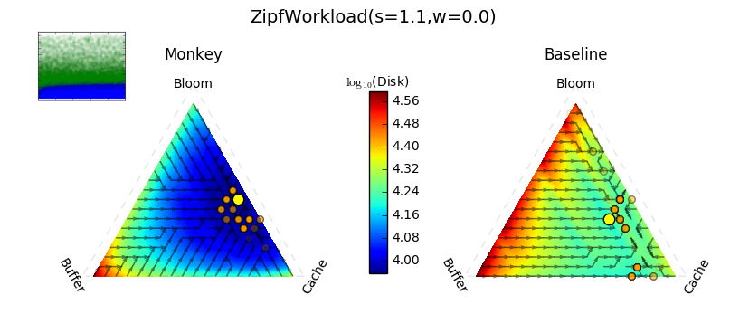

# CS265 Research Project: LSM-tree gradient descent

Mali Akmanalp, Sophie Hilgard, and Andrew Ross

## Main Question

For a given workload and initial database state, can we find the optimal allocation of memory to an LSM tree's buffer, cache, and bloom filters?

## Answer

Kind of! We can use modeling to estimate the I/O savings from adding another few bytes of memory to each component, then follow a process analogous to gradient descent through database parameter space. We can test that it works using simulations and a diverse set of workloads we model as stochastic processes.

For more details, check out the [report](https://github.com/asross/cs265/blob/master/final-report/final-report.pdf). We'll reproduce some of the nicest plots below:

